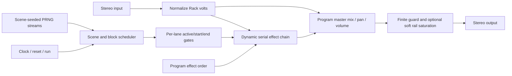

# Fray: Glitch2-Inspired VCV Rack Module Research

- Research date: 2026-07-15
- Primary reference: `/Users/shortwavlabs/Downloads/Glitch2_User_Guide.pdf` (Glitch 2.1.3, 32 pages)
- Current public product version: Glitch 2.1.4
- Target repository: `vcv-tapestry` / Rack 2
- Selected module name and permanent model slug: `Fray`

## Executive Summary

A convincing VCV Rack interpretation of Glitch2 is technically feasible, but there are two different goals that should not be conflated:

1. **Behavioral recreation:** reproduce the public workflow - a deterministic, scene-addressable, block sequencer that can overlap and reorder ten stereo effects. The attached manual is detailed enough to design this confidently.
2. **Sonic clone:** match the original parameter ranges, curves, filters, gain laws, buffer behavior, random distributions, latency, and effect transfer functions. The manual does not disclose enough information to do this, and the official license makes reverse engineering or derivative-work activity permission-sensitive.

The product will therefore be an original Shortwav Labs module named **Fray**, with the permanent model slug `Fray` and a distinct panel, layout, presets, file format, and DSP implementation. It can accurately implement the published interaction model while describing itself as a scene-sequenced glitch multi-effect, not as Glitch2 or an exact clone.

Recommended v1 shape:

- One standalone 42 HP stereo module, not a Tapestry expander.
- Eleven sequencer lanes: one control-only Randomizer plus ten audio effects.
- Up to 64 cells per lane, with block boundaries preserved.
- Reorderable serial effect chain with overlapping lane gates.
- One program with 128 CV-addressable scenes initially; retain a data model that can grow to 16 programs x 128 scenes.
- Stereo-monophonic audio, with right input normalled from left. Full Rack polyphony is not appropriate for the first release because the history buffers would multiply dramatically.
- Rack-native `CLOCK` trigger plus a separate 1 V/oct `TEMPO CV`, reset, run, scene pitch/gate, randomize, mutate, and macro-CV inputs.
- A custom NanoVG grid and effect editor, backed by fixed-capacity message queues rather than direct UI mutation of DSP state.
- An SDK-first hybrid architecture: use narrow Rack SDK primitives for voltage semantics, triggers, timers, filters, smoothing, oversampling, queues, RNG, history, persistence, standard widgets, and panel caching; keep Fray-specific scheduling, buffers, effect algorithms, and the grid as testable custom C++.

The highest engineering risks are effect activation semantics, history-buffer memory, deterministic random streams, click-free transitions, clock subdivision, scene state/UI synchronization, JSON/history size, and choosing coherent original parameter ranges. The highest release risk is intellectual-property and VCV Library policy, not DSP feasibility.

## Scope, Sources, and Confidence

### Primary sources

- Attached local manual: `/Users/shortwavlabs/Downloads/Glitch2_User_Guide.pdf`
- [Official Glitch2 product page and changelog](https://illformed.com/)
- [Official Glitch2 2.1.3 user guide](https://illformed.com/downloads/glitch_2_1_4/Glitch2_User_Guide.pdf)
- [Official Glitch licensing agreement](https://illformed.com/download/glitch2/windows/)
- [Official Illformed contact page](https://illformed.com/contact/)
- [VCV Rack Plugin API Guide](https://vcvrack.com/manual/PluginGuide)
- [VCV Rack Plugin Licensing and Ethics](https://vcvrack.com/manual/PluginLicensing)
- [VCV Rack Voltage Standards](https://vcvrack.com/manual/VoltageStandards)
- [VCV Rack Manifest reference](https://vcvrack.com/manual/Manifest)
- [VCV Rack Versioning](https://vcvrack.com/manual/Version)
- Current local Rack SDK headers in `dep/Rack-SDK/include/` (SDK 2.6.6)
- VCV Rack 2.6.6 source for `ModuleWidget::randomizeAction()`, `Engine::randomizeModule()`, `Module::onRandomize()`, and `ParamQuantity::randomize()`

Context7 resolved the authoritative current Rack documentation as `/vcvrack/rack`; the official manual and local SDK headers were used as the final API references.

### Confidence levels

| Area | Confidence | Reason |
| --- | --- | --- |
| Bank/program/scene ownership | High | Explicitly documented on manual pp. 12-18 |
| Pattern size and block editing | High | Explicitly documented on pp. 15-16 |
| Effect roster and parameter names | High | Explicitly documented on pp. 19-31 |
| Overlapping effects and user-defined order | High | Described and shown on pp. 15-16 |
| Exact signal-flow placement | Medium | Serial order is explicit; internal common-stage placement is not |
| Parameter ranges/defaults/tapers | Low | Almost entirely absent from the manual |
| Exact DSP algorithms and latency | Low | The manual describes intent, not implementations |
| RNG algorithm and selection rules | Low | Only seed-level repeatability and weights are documented |
| Preset/bank format compatibility | Unknown | File extensions are named, but schemas are not documented |

## Product and Licensing Boundary

As accessed on 2026-07-15, the official product page lists Glitch 2.1.4. The [official update endpoint](https://illformed.com/checkforupdates/glitch2/2.1.0/) dates that release to 2023-12-15. The public guide still identifies itself as 2.1.3, but the 2.1.4 changelog only mentions an external-display fix, so the guide is likely behaviorally current.

The official download license reserves publication, reproduction, and processing rights and expressly forbids altering, reverse engineering, decompiling, disassembling, reworking, and creating derivative works of the software. This does not by itself answer every legal question about independently implementing a broadly similar effect, but it does establish a conservative engineering boundary:

- Do not inspect, decompile, disassemble, patch, or copy code from the Glitch binary.
- Do not copy its artwork, panel, logo, component layout, text styling, presets, program names, or factory data.
- Do not parse or claim compatibility with `.g2prg` or `.g2bnk` files without written permission.
- Do not ship with the Glitch2 product or model name.
- Do not perform systematic binary/output matching under the Glitch license without written authorization from Illformed.

VCV's own ethics policy independently says that Library plugins may not clone another software product's brand name, model name, logo, panel design, or component layout without permission. Compliance is mandatory for VCV Library distribution.

The safe plan is an original, clean implementation of the public interaction concepts. If Shortwav Labs wants exact sonic matching, close visual correspondence, format compatibility, or prominent use of the Glitch2 name, contact `support@illformed.com` first and obtain written permission. This section is risk guidance, not legal advice.

The repository is already GPL-3.0-or-later, which is VCV's recommended open-source licensing route for Rack plugins. Keeping the module GPL-3.0-or-later avoids the separate license required for non-GPL commercial Rack plugins; VCV Library ethics and any applicable Store terms still apply.

## What the Manual Establishes

### State hierarchy

Glitch2 has three nested state levels (manual p. 17):

| Scope | Count | Owned state |
| --- | ---: | --- |
| Bank | Up to 16 programs | Entire plug-in state; `.g2bnk` in the source product |
| Program | Up to 128 scenes | Trigger mode, quantize mode, master mix/pan/volume, audio-effect order, program name |
| Scene | One active snapshot | Seed, beats, divisions, loop state, sequencer blocks, Randomizer weights, all effect settings |

The ownership distinction matters. Effect order and master output are program-wide, while patterns and effect parameters are scene-local. Moving `effectOrder` into `SceneState` would silently diverge from the documented behavior.

### Sequencer geometry

A scene contains 1-8 beats and 2-8 divisions per beat (manual p. 15), giving a grid of 2-64 steps. Four divisions per beat produces sixteenth notes; three produces eighth-note triplets. Divisions 5, 6, 7, and 8 also need to work, so the transport cannot be limited to common binary note values.

The editor supports (manual p. 16):

- Drawing a block across one or more cells.
- Moving and resizing blocks.
- Splitting one block into adjacent blocks.
- Joining adjacent blocks.
- Erasing one block, drag-erasing several blocks, or clearing a lane.

The split/join behavior proves that block identity must survive editing, so occupancy alone is insufficient. Treating an immediately adjacent second block as a fresh DSP trigger is the recommended lifecycle, but the manual does not explicitly confirm that audio behavior; it should be documented as an original choice or validated in a permissioned comparison.

Use two 64-bit masks per lane:

```cpp
struct LanePattern {
    uint64_t activeMask; // One bit per occupied cell
    uint64_t startMask;  // First cell of every distinct block
};
```

For each cell, the scheduler derives:

- `active`: the lane is currently enabled.
- `blockStart`: the current cell has a start bit.
- `blockEnd`: the next cell is inactive or begins a new adjacent block.

This representation is compact, fixed-size, fast, and preserves every documented edit operation.

### Lane roster

There are eleven lanes, of which ten process audio:

1. Randomizer - control only
2. Modulator
3. Tape Stop
4. Retrigger
5. Reverser
6. Stretcher
7. Lofi
8. Distortion
9. Gater
10. Delay
11. Shuffler

The audio effects can overlap in time and are processed in a user-defined serial order (manual pp. 15-16). Randomizer is not part of the audio order.

### Trigger modes and scene changes

Trigger mode is program-wide (manual p. 12):

- **Host:** starts with host transport; stops with transport or at the end of a non-looping scene.
- **Gate:** starts on note-on; stops on note-off, host transport stop, or at the end of a non-looping scene.
- **Latch:** starts on note-on and ignores note-off; stops with host transport or at the end of a non-looping scene.

Scene changes may be quantized to a selected interval. A scene lock can temporarily prevent incoming notes from replacing the scene being edited (manual pp. 12-13).

Rack's public v2 `Module` API does not document a portable DAW-host transport callback for ordinary third-party modules, so these need modular equivalents:

| Glitch2 concept | Rack translation |
| --- | --- |
| Host | `RUN` gate controls transport and is normalled high when unpatched |
| Gate | `SCENE_GATE` high runs the selected scene; low stops it |
| Latch | Rising `SCENE_TRIG` starts/retriggers; continues until stop or one-shot end |
| MIDI note scene | `SCENE` 1 V/oct plus gate/trigger |
| Host quantize | Queue the pending scene until the chosen clock boundary |
| Transport restart | `RESET` plus optional reset-on-run behavior |

For direct Core MIDI-CV compatibility, a useful mapping is:

```text
MIDI note = clamp(round(12 * sceneVoltage) + 60, 0, 127)
```

This maps Rack's 0 V C4 convention to MIDI note 60. A separate 0-10 V scene-index mode can be offered in the context menu if desired.

The complete 16-program translation also needs a Rack-native equivalent of MIDI Program Change, such as a 0-10 V `PROGRAM` input plus `PROGRAM NEXT/PREV` triggers. A one-program v1 intentionally defers that part of the source workflow; the panel and serialized ownership should leave room for it.

### Timing modes

Six effects use the common timing selector: Tape Stop, Retrigger, Reverser, Gater, Delay, and Shuffler (manual pp. 20, 23-25, 29-31).

| Mode | Duration rule |
| --- | --- |
| Free | Continuous, unquantized value |
| Even | Powers-of-two musical duration |
| Triplet | `2/3` of the corresponding even duration |
| Dotted | `3/2` of the corresponding even duration |

The guide describes time values as beats or fractions of a whole note and treats a whole note as one 4/4 bar. For whole-note fraction `f`:

```text
seconds = (240 / BPM) * f
```

The original's time-signature behavior outside 4/4 and its Free-mode min/max ranges are not documented.

### Randomization and repeatability

The manual documents randomization at instance, scene, effects, sequence, lane, and individual-effect levels (pp. 11, 13-16, 19, 21):

- Scene Rand changes the seed, effect states, pattern, Beats, and Divisions.
- Scene Mutate makes small changes to the pattern and effect parameters.
- Sequence Rand can replace the pattern with a non-overlapping pattern or add blocks to increase density.
- Sequence Mutate slightly moves and resizes existing blocks.
- Each lane has a pattern-Randomize action; the manual does not document a lane-level Mutate action.
- Each effect module supports Init, Rand, and Mutate.

Scene retrigger resets the main RNG state from the scene seed so playback can render predictably (p. 14). Randomizer weights also influence generated patterns, and a zero weight excludes an effect (pp. 15, 21).

Unknowns include:

- Whether a Randomizer event performs a categorical choice or independent per-effect Bernoulli trials.
- Whether selection happens per occupied cell, per block start, or at another subdivision.
- What happens when all weights are zero.
- Which effects share RNG streams.
- The exact distributions and magnitudes used by Mutate.

For Fray v1, resolve the runtime rule as one weighted-categorical choice at each Randomizer block start, no overlay when all weights are zero, and independent versioned streams per random feature. The remaining distribution and Mutate-depth details are original design work unless Illformed authorizes calibration.

### Common effect controls

Every effect module, including Randomizer, supports Copy, Paste, Init, Rand, and Mutate. Every audio-processing effect additionally inherits (manual pp. 19-20):

- Filter type: Off, low-pass, high-pass, band-pass, or band-stop.
- Frequency and Q.
- Mix from fully dry to fully wet.
- Pan from left to right.
- Volume from silence to 200% / +6 dB.

The manual does not define filter topology/slope, common-stage order, wet/dry law, pan law, coefficient smoothing, or whether the filter processes the wet path only.

## Recommended Rack Product Shape

### Standalone module, not Tapestry expander

The current `TapestryExpander` is adjacency-only, has no independent audio inputs, and is coupled to the `Tapestry` model. A scene sequencer needs its own transport, stereo I/O, persistent state, and wide interactive editor. It should be a standalone module.

Use the selected 42 HP width. It leaves enough room for readable lane labels, block-edge editing on the 64-column grid, standard Rack controls, and the added `TEMPO CV` input without making the custom display carry every interaction.

An optional narrow modulation/scene expander can come later, but the main module must remain fully usable alone.

### Proposed panel regions

| Region | Purpose |
| --- | --- |
| Header | Scene, internal tempo, external clock mode, trigger mode, quantize, beats, divisions, loop, seed |
| Main display | Eleven lanes, blocks, active step, lane solo, lane randomize, drag ordering |
| Effect editor | Selected effect's unique controls plus its common filter/mixer controls |
| Utility strip | Stereo I/O, clock/reset/run, scene CV/gate, randomize/mutate, macro CV, status outputs |

Use an original Shortwav visual language rather than reproducing the source's black landscape UI, colors, lane palette, typography, or control arrangement.

### Minimum ports

| Port | Behavior |
| --- | --- |
| `IN L`, `IN R` | Stereo audio; right normals from left |
| `OUT L`, `OUT R` | Stereo processed output |
| `CLOCK` | External trigger/gate CV; each edge means one cell or one beat, selected by `EXT MODE` |
| `TEMPO CV` | 1 V/oct internal-tempo modulation; active only while `CLOCK` is unpatched |
| `RESET` | Return to step zero; suppress clock for 1 ms after reset |
| `RUN` | Transport gate, normalled high when unpatched |
| `SCENE` | 1 V/oct scene selection by default |
| `SCENE GATE/TRIG` | Gate- or trigger-mode scene activation |
| `NEXT`, `PREV` | Optional direct scene stepping |
| `RAND`, `MUTATE` | Trigger scene operations |
| `MIX CV` | Master wet/dry modulation |
| `MOD A-D` | Assignable macro CVs; avoids dozens of front-panel jacks |

Useful outputs include end-of-scene, current-step trigger, and a ten-channel polyphonic effect-activity gate. These are modular enhancements, not requirements for translating the documented core workflow.

### Clock modes

`CLOCK` is already a CV input in Rack terminology: it receives a pulse/gate voltage. Add `TEMPO CV` as a second, continuous input because it solves a different problem - voltage-controlling Fray's internal clock. The source priority is unambiguous:

1. If `CLOCK` is patched, it owns transport. The tempo knob and `TEMPO CV` remain visible but are ignored for advancement.
2. If `CLOCK` is unpatched, use the internal 30-300 BPM clock. Store the knob as an octave offset around 120 BPM and apply `TEMPO CV` at 1 V/oct:

   ```text
   BPM = clamp(120 * 2^(tempoKnobOctaves + tempoCV), 30, 300)
   ```

   This gives 60 BPM at -1 V, 120 BPM at 0 V, and 240 BPM at +1 V before clamping. Do not add a dedicated attenuator in v1; a normal Rack attenuator module can scale it when needed.

When externally clocked, `EXT MODE` supports both agreed interpretations:

- **Step:** every accepted rising edge advances one cell immediately, including the first edge. After two edges, derive the effective tempo for synced effects as `60 / (cellPeriod * divisions)`. Before lock, retain the last valid effective tempo, or the internal setting on a cold start.
- **Beat:** every rising edge is an authoritative beat boundary; schedule the scene's 2-8 divisions between edges. The first pulse establishes phase but predicts no intermediate cells. The second pulse establishes a period and starts subdivision from that edge.

Internal tempo always uses the beat/division model; `EXT MODE` only interprets a patched `CLOCK`. Do not add a separate clock multiplier/divider in v1: Beat mode plus `Divisions` already multiplies, while Step mode accepts an externally divided cell clock.

Use transport states `UNLOCKED`, `FIRST_PULSE`, `LOCKED`, and `STALE`. A good estimator starting point is alpha 0.15 below 2% relative period error, 0.50 from 2-20%, and 1.0 above 20%; then validate those values against jitter tests. Re-anchor phase on every valid Beat edge. If an edge is early, discard unplayed subdivisions; if it is late, finish the current beat and hold rather than inventing another beat. A hot-patched first Beat edge snaps to the next scene beat boundary; immediately after Reset it simply confirms cell 0. Treat the source as stale after `max(2.5 * estimatedPeriod, 0.5 s)`. A connected-but-stopped clock holds transport and never falls back silently to the internal clock; unplugging the cable selects the internal clock.

Process Reset before Clock. Reset activates cell 0 and clears phase/pending quantized changes. Keep feeding the clock voltage to its Schmitt trigger, but ignore edge events for 1 ms after reset so same-event cable skew cannot cause an accidental step. `RUN` is a normalled-high gate: while low, observe external edges for tempo acquisition but do not advance; after it rises, wait for a genuine new edge if the clock is patched.

Use Rack's `dsp::SchmittTrigger` for Clock/Reset/Run hysteresis, `dsp::BooleanTrigger` for panel buttons, `dsp::Timer` for edge measurement/timeout/reset suppression, `dsp::PulseGenerator` for step/end outputs, and `Input::getNormalVoltage(10.f)` for Run. `dsp::ClockDivider` is appropriate for control-rate UI and lights, not musical clock multiplication. Rack's voltage standard recommends roughly 0.1 V low and 1-2 V high thresholds and a 1 ms reset guard. Fundamental's SEQ3 is a useful official precedent for an exponential tempo parameter, Tempo CV, internal/external priority, triggers, and pulse outputs.

### Stereo and polyphony

Glitch2 is explicitly stereo (manual p. 4). Implement two monophonic audio ports. If a polyphonic cable is connected, sum each L/R input with `getVoltageSum()`; when the right input is unpatched, feed the summed left signal to both channels. Do not add the `Polyphonic` manifest tag in v1.

True 16-voice stereo polyphony would multiply every history and feedback buffer. At 192 kHz, one eight-second stereo float buffer is about 12.3 MB; five such histories approach 61 MB for one module before delay and UI state, and nearly 1 GB for 16 voices. Stereo monophonic is the correct first-release boundary.

## State Model and Persistence

### Versioned internal model

```cpp
static const int kLaneCount = 11;
static const int kAudioEffectCount = 10;
static const int kMaxSteps = 64;
static const int kScenesPerProgram = 128;
static const int kProgramsPerBank = 16;

struct SceneState {
    uint8_t beats;                  // 1..8
    uint8_t divisions;              // 2..8
    bool loop;
    uint32_t seed;
    LanePattern lanes[kLaneCount];
    RandomizerParams randomizer;
    EffectParams effects[kAudioEffectCount];
};

struct ProgramState {
    std::string programName;          // UI/persistence only; never touched in process()
    TriggerMode triggerMode;
    QuantizeMode quantizeMode;
    float masterMix;
    float masterPan;
    float masterVolume;
    uint8_t effectOrder[kAudioEffectCount];
    SceneState scenes[kScenesPerProgram];
};

struct BankState {
    uint32_t schemaVersion;
    // Allocate one program in v1 and grow to at most 16 outside the audio thread.
    std::vector<ProgramState> programs;
};
```

For v1, allocate and expose one program while the schema preserves the documented ownership and can grow to sixteen. Never resize or copy this storage in the audio loop. Do not put effect order, trigger mode, or master output inside `SceneState`.

### Rack-native JSON persistence

Store the complete v1 one-program/128-scene authored state in `dataToJson()` rather than putting the bank only in patch storage. This is a material SDK-driven change. Rack presets, clipboard copy/paste, Initialize/Randomize, and `history::ModuleChange` operate on module JSON rather than snapshotting files from `createPatchStorage()`. Rack can copy patch storage during module duplication, but that does not repair the preset/history gap. A patch-storage-only bank would therefore make core native workflows incomplete.

Keep the JSON compact and versioned:

- Elide initialized/default scenes and default-valued fields; encode only populated scene records.
- Serialize lane masks as two 32-bit words or fixed-width hexadecimal strings. JSON's numeric path must not be trusted to round-trip every arbitrary `uint64_t` bit mask exactly.
- Store stable numeric IDs for enums/effects/parameters and include `schemaVersion` plus `rngVersion`.
- Measure serialized bytes and `dataToJson()`/`dataFromJson()` latency with all 128 scenes populated. Rack 2.6.6 retains up to 500 history actions, and each module-wide `ModuleChange` owns old and new JSON, so sparse encoding plus compact scene-fragment actions for frequent edits are memory requirements, not cosmetic optimization.
- Keep all JSON work outside `process()`. Rack's engine lock serializes module event/JSON callbacks with audio processing.

Reserve patch storage for a future multi-program bank, imported audio, or rebuildable cache whose omission from Rack history/presets is explicitly acceptable. If a later feature uses it, define a documented binary format, atomically write in `onSave()`, validate checksums/schema versions, and never dump compiler-dependent C++ structs. Do not implement Glitch `.g2prg` or `.g2bnk` compatibility. Optional Shortwav bank import/export remains an off-audio-thread future feature.

### Parameter exposure

There are two viable UI strategies:

1. Register stable Rack parameter IDs for every effect and show only the selected effect's widget group. This provides the best MIDI-map and automation behavior but creates many permanent parameters.
2. Store most effect controls as custom scene state and expose four assignable macro parameters. This is simpler and more modular, but individual hidden parameters cannot be mapped directly.

For fidelity and usability, use stable per-effect IDs for primary parameters plus four macros for CV. Do not use one generic knob whose semantic meaning changes with the selected effect; patches and MIDI mappings would become ambiguous.

There is one stable Rack Param set for the currently active scene, not 128 copies of every Param. Mirror visible Param changes into `SceneState`, reconcile the active Param values before serialization or scene departure, and load the destination scene's values into the same Param IDs on scene activation. Define one authoritative synchronization order for `dataFromJson()` so the base Param array and the bank copy cannot disagree. Show/hide the pre-created per-effect ParamWidget groups when selection changes; do not create or renumber widgets dynamically.

### Rack-native randomization and history

Use Rack's built-in module Randomize as Fray's canonical **randomize active scene** command. In Rack 2.6.6 the path is:

```text
ModuleWidget::randomizeAction()
  -> snapshot module JSON before
  -> Engine::randomizeModule() under the engine lock
  -> Fray::onRandomize(const RandomizeEvent&)
  -> snapshot module JSON after
  -> history::ModuleChange
```

This gives right-click **Randomize**, Ctrl+R, and undo/redo native behavior without a parallel custom system. Implement `Fray::onRandomize(e)` synchronously: call `Module::onRandomize(e)` once so eligible registered effect controls receive Rack's default behavior, copy those new visible parameter values into the active scene, then choose a new scene seed and generate the active scene's pattern, Beats/Divisions, and other non-Param state. Do not randomize the mirrored effect state twice. Do not defer custom mutation through the UI/audio queue; the second JSON snapshot must see the completed state.

Rack's base implementation skips parameters whose `ParamQuantity::randomizeEnabled` is false. Continuous parameters randomize uniformly in scaled/normalized space; snapped parameters choose an integer across their configured range. `configButton()` already disables randomization for buttons. Explicitly disable it for identity/transport/global controls such as Tempo, `EXT MODE`, Run, Reset, scene selection, output gain/pan, and macro routing. Primary scene-local effect parameters may use the default distribution; use a custom `ParamQuantity` only when a musically curated distribution is worth the added API surface.

Rack's native **Initialize** action follows the same JSON-before/after history pattern around `onReset()`. Override only the current `onReset(const ResetEvent&)`, call the base implementation, initialize the authored bank and runtime state synchronously, and define `resetEnabled` separately from the randomization policy. Audible parameters changed immediately by Initialize/Randomize still need Fray's own click-free DSP ramp.

The panel's Scene Rand action should call the same widget-level `randomizeAction()` so mouse use creates one Rack history item. Per-lane, per-effect, sequence, and Mutate commands remain explicit actions; frequent grid gestures should use compact custom `history::ModuleAction` scene fragments rather than two complete bank snapshots. A `RAND` or `MUTATE` CV edge is a performance event processed at a safe musical boundary and intentionally does not create UI history.

Use Rack's global `random::u32()` only to obtain fresh entropy for a user-initiated scene seed. Deterministic playback is separate and uses per-feature, locally seeded streams as described below.

### UI/audio synchronization

Rack guarantees mutual exclusion between a module's `process()`, event, and JSON methods, but arbitrary custom widget callbacks are not module methods. The grid must not directly mutate containers owned by the audio thread.

Use two fixed-capacity `dsp::RingBuffer<T, N>` SPSC queues from the Rack SDK:

- UI -> engine: small POD commands such as `SetBlock`, `MoveBlock`, `SplitBlock`, `SetEffectOrder`, and `SelectScene`.
- Engine -> UI: throttled snapshots containing masks, selected state, current step, active effects, and meter values.

`dsp::RingBuffer::push()` does not reject overflow, so the producer must check `full()` and apply a documented drop/coalesce policy. It is suitable for fixed POD control messages, not the long fractional audio histories, which still need a custom indexable `StereoHistoryBuffer`.

The engine copy is authoritative. Give each committed edit a monotonic sequence number and return the applied number in UI snapshots. On mouse-up, enqueue one atomic before/after scene edit and push a compact custom `history::ModuleAction` containing the `moduleId` and exact before/after scene fragment; never retain a module pointer in a history action. Undo/redo must enqueue or apply those exact states under the normal Rack event boundary. Reject stale queued commands whose base revision predates native Initialize/Randomize so an old drag cannot overwrite the new state. `dataToJson()` must incorporate every committed-but-unacknowledged edit before autosave or preset copy can serialize it.

Apply bulk edits atomically at a cell boundary or explicit safe point. Never block the audio thread waiting for an acknowledgement.

## DSP Architecture

### SDK-first boundary

Leverage Rack aggressively where it already solves a host or generic DSP problem, while keeping Fray's product-specific rules independently testable. The production module and audio-effects layer include supported `rack.hpp`; the plain-C++ sequencing core receives edges and values rather than `Module`, `Input`, `Param`, widget, JSON, or `APP` objects.

```text
Rack module/UI
  ports, triggers, timers, queues, persistence, history, widgets
                         |
                         v
Rack-backed Fray effects
  filters, smoothing, crossfades, Hann windows, oversampling,
  effect routing, custom fractional histories and Hermite reads
                         |
                         v
Rack-independent Fray core
  scene model, deterministic generation, block scheduler,
  transport prediction and serialized program state
```

This boundary avoids reimplementing mature Rack facilities while keeping deterministic scheduling portable. The core suite remains plain C++; the effect and module-adapter suites link Rack because they exercise production SDK primitives. Direct inclusion of individual SDK headers is unsupported by Rack, so `fray-effects.h` and module files include `rack.hpp` rather than relying on internal include order.

### High-level flow



Every audio effect should be a concrete processor with methods conceptually equivalent to:

```cpp
prepare(sampleRate, limits);
reset();
beginBlock(context);
processFrame(inL, inR, outL, outR, params);
endBlock(context);
tickInactive(inL, inR); // history/tails where required
```

Avoid a virtual interface in the sample loop. Store concrete processors and dispatch through a ten-entry `effectOrder` array with a small switch.

### Per-sample engine outline

1. Drain a bounded number of pending UI commands.
2. Read clock/reset/run and advance a sample-accurate phase accumulator.
3. Commit pending quantized scene changes at their boundary.
4. Derive each lane's `active`, `blockStart`, and `blockEnd` state.
5. Resolve Randomizer overlay gates without mutating the authored pattern.
6. Normalize Rack audio from typical +/-5 V to an internal approximately +/-1 range.
7. For each effect ID in program order:
   - Update its required background history.
   - If active, process the current stereo frame.
   - Apply its common wet/filter/mix/pan/volume stage.
   - Crossfade activation and release edges.
8. Mix the original module input with the final chain at the program master stage.
9. Guard NaN/Inf, soft-saturate only when needed, and return to Rack voltage scale.
10. Publish low-rate UI telemetry without allocating or locking.

No file I/O, JSON, logging, mutexes, thread joins, memory allocation, or container growth may occur in `process()`.

### History buffers and memory

History-based effects cannot all use one raw-input ring if effect order is dynamic. When two capture effects overlap at different points in the chain, each must see its own upstream signal. A single shared module-input history would be cheaper but would change the documented serial-order behavior.

Preferred design:

- One bounded logical history per capture effect, sized to that effect's measured or designed maximum.
- One allocation arena may back the histories, but each effect receives an independent slice and write head.
- Delay owns a separate feedback line.
- Shuffler capture onset is unverified. Default to recording its local chain input from block start, matching the manual's advice that slices be shorter than the block; optional inactive pre-roll would be an explicitly original mode.
- Effects that only capture on block start may use a shorter block-local buffer.

An effect-order change also changes every downstream effect's local input history. Commit reordering at a cell or scene boundary, crossfade the chain, and clear/re-prime affected histories and delay tails. Preserving old tails across the reorder is possible, but must be an intentional documented mode rather than accidental stale state.

Potential histories are Tape Stop, Retrigger, Reverser, Stretcher, and Shuffler, plus Delay feedback. Set a supported minimum BPM and explicit maximum seconds for every musical-time parameter so memory is bounded. Allocate/reallocate during construction or sample-rate change, never in the audio loop.

The accepted v1 deactivation policy is effect-specific: Delay continues processing its feedback tail after the lane turns off, while capture effects crossfade cleanly back to their dry/local-chain input and stop their captured playback. A later scene or order change may explicitly clear/crossfade histories; it must never leave stale captured audio active by accident.

Do not reuse `TapestryBuffer` directly. It preallocates about 66.8 MB for a 2.9-minute 48 kHz stereo reel and carries reel/splice assumptions. Extract its interpolation ideas into a small duration-bounded stereo circular buffer instead.

### Common filter and mixer

An original, defensible first implementation is:

```text
effect core -> multimode filter -> effect wet/dry -> constant-power pan -> volume
```

Recommended components:

- Two `dsp::BiquadFilter` instances per effect for stereo LP/HP/BP/notch; its normalized cutoff must remain below 0.5.
- Exponential cutoff mapping, bounded Q, and SDK `ExponentialFilter`/`SlewLimiter` smoothing. Recalculate biquad coefficients when controls change or at a divided control rate, not on every sample.
- Linear dry/wet initially, unless listening tests favor equal-power.
- Constant-power pan.
- Volume 0-2, matching the manual's silence to +6 dB range.
- A 2-5 ms activation/release ramp to prevent unintended clicks.

This ordering is a design proposal, not a claim about Glitch2 internals. Exact-duration activation ramps use Rack `SlewLimiter` instances configured from the defined 3 ms and 4 ms transition lengths.

### Deterministic PRNG design

Keep Fray's small versioned `Xoroshiro128Plus` stream local for deterministic playback. Rack exposes the same family of generator, but its seeding behavior and future SDK implementation are outside Fray's patch-format control. Instantiate and seed a separate local generator per feature; use Rack's global RNG only to create new authored seeds during explicit Randomize/Mutate actions. Store an RNG version and lock representative output sequences in golden tests.

Partition independent streams for:

- Runtime Randomizer choices.
- Shuffler slice choices.
- Stretcher grain jitter.
- Scene/pattern Randomize.
- Parameter Mutate.
- Program-name generation, if retained.

Derive streams from `sceneSeed`, program index, scene index, feature ID, and block ordinal. Independent streams prevent a new random feature or changed effect order from perturbing every later decision. Store an RNG-version number so future algorithm changes can migrate old patches deliberately.

An original Randomizer rule should be documented. Because the manual defines weights relatively (for example, 20 is twice as likely as 10), the conservative v1 rule is one weighted categorical choice per Randomizer block start. A multi-select Bernoulli mode could be a useful original extension, but it changes weights into absolute activation probabilities and should not be presented as verified source behavior.

## Effect-by-Effect Design

All algorithms below are independent implementation proposals based on the published behavior. They are not claims about Illformed's source code.

### Effect matrix

| Effect | Manual parameters | Proposed core | Main unknowns |
| --- | --- | --- | --- |
| Randomizer | Ten effect weights | Seeded weighted categorical choice | Selection rule and cadence |
| Modulator | Frequency, Depth, Osc Vol, Spread, FM Depth/Attack/Release | Stereo sine ring/AM plus envelope FM | AM equation and FM scale |
| Tape Stop | Timing, Slow Down, Speed Up, four Play Modes | Variable-rate history read head | Curves, stop output, catch-up |
| Retrigger | Timing, Initial/Final Speed, Transition, Decay | Captured repeat loop with changing interval | Whether speed changes interval, pitch, or both |
| Reverser | Timing, Time, Point A/B | Captured ping-pong read address | Capture onset and endpoint behavior |
| Stretcher | Speed, Grain Size, Jitter, Smoothing, GM Depth/Attack/Release | 2-4 grain overlap/add | Grain topology and speed law |
| Lofi | Signed/Unsigned, Bit Depth, Frequency, FM Depth/Attack/Release | Mid-tread/mid-rise quantizer and sample-hold | Exact bit/rate ranges |
| Distortion | Razor/Shape/Fold/Shift, Drive, Tone, Wet, Dry | Four nonlinear curves plus tilt | Transfer functions and oversampling |
| Gater | Timing, Step Time, Smoothing, Steps, 16 levels | Nested 16-step VCA | Phase/reset and slew curve |
| Delay | Timing, Time, Slew, Spread, Send, Feedback, Return | Stereo fractional feedback delay | Max time and gain topology |
| Shuffler | Timing, Min/Max Time, Range, Shuffle/Repeat/Reverse | Seeded historical slice player | Probability ordering and slice alignment |

### Randomizer

Randomizer produces no audio and has no common filter/mixer (manual p. 21). Its weights affect runtime Randomizer blocks and pattern-generation actions.

Implementation:

- Evaluate weights only at a defined event, preferably block start.
- Select one eligible effect by cumulative relative weight and generate a temporary overlay gate; never rewrite the stored lane masks during playback.
- Give generated effects the same block lifecycle as authored effects.
- If all weights are zero, produce no overlay.
- Display Randomizer-triggered activity separately from authored activity.

### Modulator

The manual describes amplitude/ring modulation by an internal stereo sine carrier, audible carrier injection, phase Spread, and envelope-followed FM (p. 22).

One original Depth law that transitions continuously from dry through unipolar AM to ring modulation is:

```text
carrier = sin(phase)
gain = 1 - depth + depth * carrier
wet = input * gain + oscVolume * carrier
frequency = baseFrequency * 2^(fmOctaves * envelope)
```

At Depth 0 this is dry, at 0.5 the gain is unipolar AM, and at 1 it is bipolar ring modulation. Use independent attack/release coefficients, one coherent envelope for stereo, and explicit left/right phase offsets. At low carrier rates, phase-spread gains can produce the manual's autopan-like result, but the exact phase convention and pan law are not disclosed; validate mono compatibility and do not claim constant-power panning without a separate gain design. Clamp instantaneous frequency below Nyquist.

### Tape Stop

The four play modes are explicit on manual p. 23. Model them as a small state machine driving playback increment `v(t)` between 1 and 0.

- Continuously record the effect's local input into a stereo circular buffer.
- Read with cubic Hermite or fourth-order Lagrange interpolation.
- Use a smooth motor-like curve for `v(t)` rather than a linear zipper.
- At complete stop, either hold the last sample with DC protection or fade toward zero; make this a documented design choice.
- Returning from zero speed cannot naturally catch the live write head at exactly `v=1`; finish with a short crossfade to live audio or a brief hidden catch-up phase.
- Reset/crossfade whenever the selected lifecycle reports `blockStart`, including an adjacent block only if the documented original policy chooses retrigger-at-boundary.

Julius O. Smith's [time-varying delay discussion](https://www.dsprelated.com/freebooks/pasp/Time_Varying_Delay_Effects.html) provides an independent basis for interpolated moving read heads and their Doppler pitch behavior.

### Retrigger

The source captures audio and changes retrigger speed from Initial to Final over Transition Time, with per-repeat decay (manual p. 24).

An original first pass should treat speed as repeat frequency:

- Capture a maximum source segment at block onset.
- Interpolate repeat interval geometrically between initial and final values; musical rates feel more uniform in log space.
- Replay the appropriate prefix or captured window on every repeat.
- Apply `gain = exp(-decay * repeatIndex)` or an equivalent documented law.
- Use a short boundary crossfade/window to avoid clicks.

Whether Glitch2 also pitch-resamples the slice is unknown. Keep repeat-rate change and playback-rate change separate internally so an authorized calibration pass could adjust the behavior later.

### Reverser

The source plays forward from Point A to B, then backward to A indefinitely (manual p. 25).

- Capture a Time-sized local buffer or freeze a bounded pre-roll range at block start.
- Convert Point A/B to ordered normalized bounds and enforce a small minimum separation.
- Drive the read address with a triangle/ping-pong phase.
- Avoid duplicating endpoints when direction changes.
- Use fractional interpolation and a very short smoothing window at captures/bounds.
- Define output while the initial capture region is not yet full.

The manual does not reveal whether capture starts at activation or draws from already recorded history. This is a high-priority permission-gated calibration question.

### Stretcher

The manual explicitly calls this a simple granular time-stretch resembling late-1980s/early-1990s samplers (p. 26). A high-quality spectral library would be less faithful to that intent.

- Use 2-4 overlapping grains with Hann or trapezoidal windows.
- Advance the source origin by Speed while each active grain reads at a defined local rate.
- Choose Grain Size and Jitter only when spawning a grain; never resize an active grain.
- Let Smoothing control overlap/crossfade, with gain normalization across active windows.
- Modulate future grain size from a stereo-linked attack/release envelope.
- Use a dedicated deterministic jitter stream.
- Implement bounded drift/collision recovery between live writer and stretched read origin.

The existing Tapestry grain engine supplies useful concepts - four voices, Hann windows, fractional reads - but it is coupled to reel/splice state and should not be reused wholesale. Miller Puckette's [granular sampling discussion](https://msp.ucsd.edu/techniques/latest/book-html/node28.html) is an independent algorithm reference.

### Lofi

The Signed/Unsigned diagrams on manual p. 27 imply two distinct quantizers:

- **Signed:** mid-tread quantization with a level at zero and a silence/dead zone.
- **Unsigned:** mid-rise quantization with no exact zero level.

Use a phase accumulator for fractional sample-rate reduction:

```text
holdPhase += targetFrequency / sampleRate
if holdPhase >= 1:
    holdPhase -= 1
    heldSample = quantize(input)
```

The stereo channels should share the hold phase but quantize their own amplitudes. Envelope FM changes `targetFrequency` using attack/release smoothing. Do not add anti-alias filtering by default; aliasing is part of this effect's character. Dither should be off unless offered as an original optional mode.

The existing `BitCrusherDSP` is a useful scaffold but lacks Signed/Unsigned modes, frequency-in-Hz control, and envelope modulation, so this is a rewrite rather than a drop-in reuse.

### Distortion

Manual p. 28 defines four qualitative modes:

- Razor: hard clip.
- Shape: soft waveshaping.
- Fold: periodic foldback.
- Shift: rectification/fuzzy octave behavior.

Clean original choices:

- Razor: `clamp(drive * x, -1, 1)`.
- Shape: normalized `tanh`, `atan`, or cubic soft clip.
- Fold: triangle fold with bounded modulo math.
- Shift: full-wave or asymmetric rectification followed by DC blocking.
- Tone: pre/post tilt EQ or opposing low/high shelves.

The manual exposes effect-specific Wet and Dry controls alongside the inherited common Mix control, but does not establish their routing or independence. Preserve all controls and document the chosen two-stage topology as an original design. Prototype nonlinear modes at 2x and 4x with Rack's fixed-size `dsp::Upsampler<N, Q>` and `dsp::Decimator<N, Q>` in the production adapter. They allocate no hot-path memory, but use naive FIR convolution, so benchmark both quality and CPU before making 4x the default. An intentionally raw quality mode may also be musically useful.

### Gater

Gater contains its own up-to-16-step volume sequencer in addition to the main lane sequencer (manual p. 29 and screenshot on p. 17).

- Store step count and 16 gain values in each scene.
- Advance at Step Time using the shared Free/Even/Triplet/Dotted converter.
- Smooth toward the next gain with a slew limiter or one-pole whose coefficient is sample-rate independent.
- Reset its nested phase at block start for predictable patterns, unless an explicitly documented free-running mode is added.
- At zero Smoothing, retain a tiny dezipper unless hard clicks are a deliberate option.

### Delay

Manual p. 30 describes a tempo delay whose time morphs slowly at low Slew and rapidly at high Slew. This strongly suggests a continuously moving fractional read tap, with the resulting dub-style pitch warp treated as a feature.

Suggested topology:

```text
delayed = delay.read(smoothedTime)
delay.write(send * input + feedback * saturate(delayed))
processed = input + return * delayed
```

- Smooth delay length, not output amplitude.
- Negative Spread lengthens left; positive Spread lengthens right.
- Use cubic or Lagrange interpolation.
- Keep feedback below unity for the safe range, or soft-saturate inside the loop if 100% self-oscillation is offered.
- Continue updating the feedback line while inactive so the accepted Delay tail decays naturally; crossfade its returned tail according to the scene/order transition policy.
- Align the effect's dry branch if the interpolation/topology adds latency.

Smith's [delay-line interpolation reference](https://www.dsprelated.com/freebooks/pasp/Delay_Line_Signal_Interpolation.html) explains the trade-offs between linear, Lagrange, and allpass interpolation.

### Shuffler

Shuffler records input, chooses buffered slices, and may shuffle, repeat, or reverse them (manual p. 31). The guide does not clearly establish whether recording continues while the lane is inactive.

- By default, begin filling the local history at block start and restrict choices to initialized audio. Offer inactive pre-roll only as a clearly labeled original option.
- At each slice boundary, choose a duration between Min and Max using the timing mode.
- If Repeat fires, reuse the previous source slice.
- If Shuffle fires, select a valid historical start within Range.
- If Reverse fires, traverse that slice backward.
- Crossfade 3-10 ms at slice boundaries.
- Clamp selection to initialized history during startup.
- Seed all choices from the dedicated scene Shuffler stream.

Document the ordering of Repeat, Shuffle, and Reverse probability tests; the manual does not define it.

## Output, Bypass, and Sample-Rate Behavior

Rack audio is typically +/-5 V. Normalize to approximately +/-1 internally and return to voltage at the output. Because per-effect and master volume can exceed unity, apply a smooth safety stage near the Eurorack rails when needed, not an unconditional hard clip at +/-5 V. Always replace non-finite output with zero.

Configure stereo bypass routes with `configBypass(IN_L, OUT_L)` and `configBypass(IN_R, OUT_R)`, and override `processBypass()` so an unpatched right input still receives left while bypassed. Rack's default route copies the physical right input only and cannot reproduce Fray's software normaling.

On sample-rate change:

- Recompute every filter, envelope, smoothing, and clock coefficient.
- Resize bounded histories outside `process()`.
- Clear or safely migrate read/write indices.
- Reset resampler/oversampling state.
- Preserve scene/program settings but allow capture audio to clear; retaining incorrectly indexed history is worse than a documented reset.

Native-rate processing is the v1 decision. A future fixed internal 48 kHz mode could use `dsp::SampleRateConverter<2>`, but its Speex state may be destroyed/reallocated when rates, quality, or channel count change, so configuration belongs only in lifecycle events. Do not inherit Tapestry's internal-rate assumptions accidentally.

## Repository Integration

### Rack SDK reuse matrix

| Concern | Rack facility to use | Fray-specific work that remains |
| --- | --- | --- |
| Ports and parameter metadata | `configInput/Output/Param/Switch/Button`, normalled input helpers, `configBypass` | Stereo-R normaling in custom `processBypass()`, scene-to-visible-param synchronization |
| Clock/control edges | `dsp::SchmittTrigger`, `BooleanTrigger`, `Timer`, `PulseGenerator` | External period estimator, beat prediction, phase correction, musical subdivision |
| Control-rate work | `dsp::ClockDivider` | Choose rates and dirty conditions; never use it as a musical divider |
| Common filters/smoothing | `dsp::BiquadFilter`, `ExponentialFilter`, `PeakFilter`, `SlewLimiter`, `ExponentialSlewLimiter` | Mappings, update cadence, exact finite activation ramps |
| Distortion oversampling | `dsp::Upsampler` / `Decimator` | Select 2x/4x quality by measurements; nonlinear modes |
| Deterministic RNG | Rack global RNG only for explicit new authored seeds | Version-pinned local Xoroshiro stream, stream derivation, golden compatibility tests |
| Math and windows | `math::clampSafe`, `rescale`, `crossfade`, `interpolateLinear`; `dsp::hann` | Equal-power laws, wrap-aware cubic/Lagrange delay reads |
| UI/audio mailboxes | `dsp::RingBuffer<POD, powerOfTwo>` | Overflow/coalescing policy and revision rejection |
| Metering | `dsp::VuMeter2`, smoothed lights | Control-rate publishing and panel presentation |
| State and host workflow | Params, `dataToJson/fromJson`, lifecycle events, `history::ModuleChange`/`ModuleAction` | Compact scene schema, migrations, scene-fragment history actions |
| Panel and controls | `createPanel(light)`, centered helpers, themed ports/screws/knobs/switches/buttons/lights, menu helpers | Original layout and only the block grid/effect editor interactions |
| Grid rendering | `OpaqueWidget` plus a cached `FramebufferWidget` | Cache invalidation and a separate live playhead/hover/drag overlay |
| Presets and menus | Rack's standard preset scanning and module context menu | Only Fray-specific clock/addressing/quality items |

Do not use `dsp::RingBuffer` for long audio delay/history storage: it is a fixed FIFO, not an arbitrary fractional-read circular delay. Do not add SIMD merely because `simd::float_4` exists; v1 is two-channel stereo, so profile first. Four simultaneous grains may be a better SIMD target than ordinary L/R processing.

### Useful existing patterns

| Existing code | Reuse decision |
| --- | --- |
| `src/Korupt.*` thin Rack wrapper and model registration | Good structural model |
| `Tapestry` stereo I/O, bypass, JSON, custom NanoVG display | Reuse concepts, not shared mutable UI state |
| `TapestryUtil::cubicInterpolate` | Extract/adapt into a small shared interpolation utility |
| `FastRandom` in `tapestry-core.h` | Do not extend; Fray owns a separate versioned Xoroshiro stream contract |
| `GrainEngine` Hann windows and four voices | Extract concepts for Stretcher |
| `BitCrusherDSP` | Scaffold only; extend/rewrite for full Lofi behavior |
| `SmoothParam` in `TapestryExpander.hpp` | Do not duplicate; prefer Rack's filter/slew primitives except for exact finite ramps |
| `TapestryBuffer` | Do not reuse; far too large and reel-specific |
| Tapestry detached file threads / direct display access | Do not copy; use bounded mailboxes and event-time persistence |

### Implemented files

Use the selected module name and permanent model slug `Fray`:

```text
src/Fray.hpp
src/Fray.cpp
src/dsp/fray-core.h
src/dsp/fray-effects.h
src/tests/test_fray_core.cpp
src/tests/test_fray_effects.cpp
src/tests/test_fray_module.cpp
res/FRAY.svg
docs/FRAY.md
```

Likely edits:

- `src/plugin.hpp`: declare the model.
- `src/plugin.cpp`: register the model.
- `plugin.json`: add the permanent module slug, name, description, and tags.
- `run_tests.sh`: add the new suite.
- `Makefile`: no change; Fray DSP is header-only and `src/Fray.cpp` is already discovered by the existing source glob.
- README, docs index, changelog, and user manual after implementation.

`fray-core.h` remains Rack-independent and header-only. `fray-effects.h` is the single Rack-backed audio layer: it owns the common post stages and the sole distortion implementation, using supported `rack.hpp` primitives for filters, slews, crossfades, Hann windows, and oversampling. `Fray.hpp/.cpp` now stay focused on voltage I/O, sequencing, queues, persistence, history, and widgets. The effect test is Rack-linked; the Makefile remains unchanged.

### Resolved build and CI decisions

1. The engine and all tests use Rack's C++11 standard.
2. CI downloads the pinned Rack SDK 2.6.6 before Rack-linked tests.
3. Tapestry's test main returns its recorded failure count, so CI propagates failures.
4. Linux x64, Windows x64, macOS ARM64, and macOS x64 are covered.
5. `FRAY.svg` contains no live SVG text nodes; dynamic labels are drawn by the module widget.
6. The existing Makefile remains unchanged because Rack's normal source glob already discovers `src/Fray.cpp`.

## Permission-Gated Calibration Plan

The manual omits nearly every exact range, default, taper, transfer function, buffer size, smoothing law, and RNG detail. If Illformed grants written permission for systematic behavior/sonic comparison, use a controlled black-box test matrix. Otherwise, skip this section and document the original Shortwav choices.

### Test signals

- Single impulses and impulse trains with unique amplitudes.
- Low-frequency sine/ramp for static nonlinear transfer curves.
- Log sweep and pink/white noise for filter magnitude response.
- Stereo-correlated and anti-correlated signals for pan/spread laws.
- Ascending coded impulses for read-head direction and slice reconstruction.
- Silence/DC for denormal, gate, quantizer, and stopped-tape behavior.

### Measurements

| Area | Measurement |
| --- | --- |
| Parameters | Enumerate host-exposed normalized values; record labels, units, defaults, step counts, and tapers |
| Common filter | Impulse/noise response for each type, cutoff, and Q; determine slope and wet placement |
| Mix/pan/volume | RMS and phase across sweeps; determine linear/equal-power and pan law |
| Activation | Place impulses around block boundaries; detect pre-roll, capture onset, fades, tails, and reset |
| Tape Stop | Track read-head speed from coded impulses across all four modes |
| Retrigger | Infer repeat interval, capture length, pitch coupling, transition curve, and decay law |
| Reverser | Infer capture timing, A/B mapping, endpoint duplication, and interpolation |
| Stretcher | Measure latency, grain spacing/windowing, speed law, jitter distribution, and envelope response |
| Lofi | Map quantizer thresholds and hold cadence across bit/frequency controls |
| Distortion | Plot static transfer curves and alias spectra for all four modes |
| Gater | Infer step phase, retrigger policy, smoothing curve, and level range |
| Delay | Infer topology, max time, slew law, spread units, feedback ceiling, and tails |
| Shuffler | Decode source slice, repeat/reverse ordering, range distribution, and boundary fades |
| RNG | Repeat renders at fixed seeds, block sizes, rates, and scene retriggers; test stream coupling |
| Transport | Test tempo changes, relocation, quantize intervals, one-shot end, and held-note priority |

Do not redistribute source presets or proprietary test outputs. Store only Shortwav-authored stimuli, derived measurements, and fixtures that written permission allows.

## Test and Validation Strategy

### Pure DSP tests

- 44.1, 48, 96, and 192 kHz.
- Silence, DC, impulse, sine, noise, extreme finite values, and long-run stability.
- Every effect at min/default/max and rapid parameter changes.
- Buffer wrap, startup underfill, adjacent block boundaries under the selected lifecycle policy, and reset.
- LP/HP/BP/notch response and high-Q stability.
- Stereo coherence and left/right Spread behavior.
- Fixed-seed Randomizer, Shuffler, and Stretcher determinism across runs, plus golden `Xoroshiro128Plus` sequences for every persisted RNG version.
- Pattern masks at 2 and 64 steps, split/join adjacency, overlaps, each effect in every chain position, and representative/random order permutations.
- Clock Schmitt hysteresis, Step first-edge behavior, Beat second-edge lock, all divisions 2-8, jitter, abrupt tempo changes, missing-clock timeout/reacquisition, hot-patch/unplug, Run changes, one-shot end, and reset/clock coincidence including the full 1 ms suppression window.
- Internal Tempo CV octave mapping and 30-300 BPM clamps: -1 V = 60 BPM, 0 V = 120 BPM, +1 V = 240 BPM at the default knob position.
- Serialization round-trip and schema migration.
- An allocation counter proving zero allocations during `processFrame()`.

### Artifact and click tests

- Measure peak discontinuity at every effect start/end and scene change.
- Verify dry/wet phase alignment for latency-bearing effects.
- Spectral checks for distortion aliasing at each oversampling quality.
- Verify Tape Stop/Reverser/Shuffler interpolation does not produce NaN or out-of-range reads.
- Verify Delay feedback remains bounded or intentionally soft-saturated.

### Performance tests

- Worst case: all ten effects active, maximum supported histories, highest Q/feedback, 192 kHz.
- Benchmark mean and high-percentile processing time against the real-time budget.
- Multiple instances in one patch.
- UI open/closed comparison and framebuffer dirty-rate profiling.
- Memory accounting per effect and per module instance.
- Fully populated 128-scene JSON size, serialize/restore latency, and worst-reasonable native Randomize history memory.

### Rack integration tests

- Plugin load in Rack development mode and clean log.
- Stereo bypass and mono-to-stereo normaling.
- Cable connect/disconnect while running.
- Patch save/reload, module duplicate, preset save/load, and exact full-bank round trips.
- Context-menu/keyboard Initialize and Randomize; undo/redo exact masks, seeds, and parameters; excluded transport/global parameters; click-free parameter transitions.
- UI grid/effect history, stale-command revision rejection after native Randomize, and CV Rand/Mutate with no UI-history entry.
- Sample-rate changes while idle and active.
- Zoom, high-DPI, room brightness, and module screenshot generation.
- Cross-platform packages for Linux x64, Windows x64, macOS x64, and macOS ARM64.

## Phased Implementation Plan

### Phase 0 - Freeze contracts and repair the baseline

- Reserve the permanent `Fray` model slug, 42 HP width, original visual direction, and public positioning.
- Record the accepted v1 decisions: stereo monophonic, one program/128 scenes, native sample rate, Step and Beat external modes, `CLOCK` plus 1 V/oct `TEMPO CV`, stable effect Param IDs plus four macros, weighted-categorical Randomizer, continuing Delay tails, and capture-effect crossfade-off behavior.
- Record original clean-room sonics as the v1 boundary; any future exact-match calibration is a separate permission-gated project.
- Pin Rack SDK 2.6.6, download it before Rack-linked tests, align the C++ standard, fix test failure propagation, and add the Rack-adapter smoke-test target.
- Define the supported `rack.hpp` adapter boundary and list every reused SDK facility before writing a duplicate utility.

Exit criterion: a written product/state/clock contract and a clean reproducible baseline build on the pinned SDK.

### Phase 1 - Rack-native shell, persistence, randomization, and transport

- Register the module and stable parameters/ports; use standard Rack panel/components, context menu, presets, bypass, tooltips, and MIDI-mappable `ParamQuantity` metadata.
- Implement compact versioned `dataToJson()/dataFromJson()` for the full sparse one-program/128-scene state. Set explicit serialized-size and latency budgets and validate presets, duplicate/copy-paste, patch reload, and schema migration.
- Define `randomizeEnabled`/`resetEnabled` for every Param. Implement current-event `onRandomize()` for newly seeded active-scene generation with deterministic subsequent playback, and `onReset()` for whole-module initialization. Verify Rack's native history end to end.
- Implement `CLOCK`, `TEMPO CV`, Reset, and normalled-high Run with SDK triggers/timers. Complete the `UNLOCKED`/`FIRST_PULSE`/`LOCKED`/`STALE` transport, both external modes, 1 ms reset guard, timeout, internal 30-300 BPM clock, scene queueing, and versioned local RNG streams.
- Draw the custom grid as a cached pattern framebuffer plus live playhead/gesture overlay. Connect it with checked SDK SPSC queues, state revisions, and compact Rack scene-fragment history actions.
- Add stereo I/O, explicit mono-to-stereo bypass normaling, finite guards, lights/meters, and model registration; no effects yet.

Exit criterion: every 2-64-step scene edits and runs sample-accurately; all 128 scenes survive native Rack workflows; Randomize/Initialize undo exactly; every clock/CV acquisition and reset case passes at 44.1-192 kHz.

### Phase 2 - SDK common stage and first vertical slice

- Implement the common stereo `dsp::BiquadFilter` stage, SDK smoothers, macro modulation, explicit activation ramps, common mixer, and custom bounded fractional-history primitive.
- Add Lofi, Gater, and Delay. These cover a non-buffered destructive effect, nested timing, and feedback history.
- Validate effect overlap/order changes, selected tail behavior, scene transitions, and native per-effect Param mapping.

Exit criterion: a musically useful three-effect Fray with deterministic recall, bounded memory, and no realtime allocations.

### Phase 3 - Capture effects

- Add Retrigger, Reverser, Tape Stop, and Shuffler.
- Prove per-effect local-history semantics, the chosen capture-onset policy, block starts/ends, wrap-aware interpolation, memory ceilings, and reorder crossfades.

Exit criterion: no invalid reads, unintended clicks, stale tails after reordering, or realtime overruns at supported limits.

### Phase 4 - Remaining DSP and SDK oversampling

- Add Modulator, Distortion, and Stretcher.
- Prototype Rack `Upsampler`/`Decimator` at 2x and 4x; choose the shipped quality from alias/CPU measurements.
- Complete per-effect randomize/mutate rules and golden deterministic stream tests.

Exit criterion: all ten audio effects and the control-only Randomizer are functional, deterministic after seeding, and within CPU/memory budgets.

### Phase 5 - Complete authoring workflow

- Complete quantized scene changes, Gate/Latch/Run behavior, scene lock, copy/paste, sequence/lane/effect Rand and Mutate, effect solo, and drag ordering.
- Use native module-level Initialize/Randomize rather than recreating them. Use compact Rack history actions for frequent editor gestures and exact scene/effect operations.
- Keep the full 16-program bank out of v1. Revisit it only after measurements show how patch storage, external bank import/export, presets, and history should interact.

Exit criterion: the documented one-program/128-scene core workflow is complete, and every ambiguous activation/RNG/transport behavior is recorded as an original Fray choice.

### Phase 6 - Original-sonics freeze and release

- Freeze, measure, and document the original Shortwav ranges/curves. Run the separate calibration matrix only if a later written-permission project is explicitly opened.
- Add original factory presets, user manual, changelog, CPU/memory specifications, and full-platform CI.
- Run VCV Library policy review, patch/preset migration tests, multi-instance soak tests, and screenshot/artifact verification.

Exit criterion: clean cross-platform packages, no unresolved compatibility migrations, and measured release CPU/memory limits.

## Locked and Remaining Decisions

The v1 direction is now locked: **Fray**, 42 HP, one program/128 scenes, stereo monophonic, native sample rate, both Step and Beat external clock modes, `CLOCK` plus 1 V/oct `TEMPO CV`, stable per-effect Rack Param IDs plus four macros, one weighted-categorical Randomizer selection per block start, independent versioned random streams, per-effect local histories, Delay tails continuing, capture effects crossfading off, and original clean-room sonics without exact-source calibration.

The remaining engineering decisions can be resolved with prototypes and measurements rather than more product input:

1. Linear versus equal-power per-effect mix, including dry/wet phase alignment.
2. Capture-at-start versus bounded inactive pre-roll for Retrigger, Reverser, Tape Stop, and Shuffler.
3. Maximum tempo-relative durations, external-clock sanity bounds, and memory ceilings.
4. Default 2x versus 4x distortion oversampling after SDK-resampler CPU/alias tests.
5. Exact original ranges, tapers, waveshapers, mutation depths, and click-ramp lengths.

## Final Recommendation

Proceed with an original Shortwav Labs scene-sequenced multi-effect, architected around the manual's strongest and most distinctive public ideas:

- 128 note-addressable scenes.
- A deterministic seed per scene.
- Eleven block lanes over a 2-64-cell grid.
- Multiple simultaneous effects.
- Ten reorderable stereo processors with common filter/mixer stages.
- Randomize and Mutate at scene, sequence, and effect levels, plus per-lane pattern Randomize.
- A pulse/gate `CLOCK`, internal 30-300 BPM clock with 1 V/oct `TEMPO CV`, Reset/Run, and CV-addressable scene control.
- Native Rack Initialize/Randomize, presets, undo/redo, standard controls, and SDK DSP utilities wherever they fit.

Do not describe the first implementation as an exact Glitch2 clone. The workflow can be recreated with high confidence; sonic identity cannot be established from the manual alone. Treat exact matching as a separate, written-permission calibration project. This yields a module that is technically tractable, native to VCV Rack, compatible with the existing Tapestry repository, and much safer to distribute.

## References

- Illformed, [Glitch2 product page](https://illformed.com/), accessed 2026-07-15.
- Illformed, [Glitch 2.1.3 User Guide](https://illformed.com/downloads/glitch_2_1_4/Glitch2_User_Guide.pdf), 32 pages.
- Illformed, [Glitch licensing agreement](https://illformed.com/download/glitch2/windows/), accessed 2026-07-15.
- VCV, [Plugin Development Tutorial](https://vcvrack.com/manual/PluginDevelopmentTutorial).
- VCV, [Plugin API Guide](https://vcvrack.com/manual/PluginGuide).
- VCV, [`engine::Module` and patch-storage API](https://vcvrack.com/docs-v2/structrack_1_1engine_1_1Module).
- VCV, [`Module::ProcessArgs`](https://vcvrack.com/docs-v2/structrack_1_1engine_1_1Module_1_1ProcessArgs).
- VCV, [Plugin Licensing and Ethics](https://vcvrack.com/manual/PluginLicensing).
- VCV, [Voltage Standards](https://vcvrack.com/manual/VoltageStandards).
- VCV, [Polyphony](https://vcvrack.com/manual/Polyphony).
- VCV, [Presets](https://vcvrack.com/manual/Presets).
- VCV, [Plugin Manifest](https://vcvrack.com/manual/Manifest).
- VCV, [Versioning](https://vcvrack.com/manual/Version).
- VCV, [Library submission repository and policy](https://github.com/VCVRack/library).
- VCV Rack 2.6.6, [`ModuleWidget::randomizeAction()` and Initialize history](https://github.com/VCVRack/Rack/blob/v2.6.6/src/app/ModuleWidget.cpp#L759-L787).
- VCV Rack 2.6.6, [`Engine::randomizeModule()` and JSON locking](https://github.com/VCVRack/Rack/blob/v2.6.6/src/engine/Engine.cpp#L871-L925).
- VCV Rack 2.6.6, [`Module::onRandomize()` and module JSON](https://github.com/VCVRack/Rack/blob/v2.6.6/src/engine/Module.cpp#L110-L283).
- VCV Rack 2.6.6, [`ParamQuantity::randomize()` distributions](https://github.com/VCVRack/Rack/blob/v2.6.6/src/engine/ParamQuantity.cpp#L150-L169).
- VCV Rack 2.6.6, [`ModuleChange` restore and history limit](https://github.com/VCVRack/Rack/blob/v2.6.6/src/history.cpp#L114-L260).
- VCV Fundamental, [SEQ3 tempo/clock/randomization precedent](https://github.com/VCVRack/Fundamental/blob/v2/src/SEQ3.cpp).
- Julius O. Smith III, [Physical Audio Signal Processing: Delay-Line and Signal Interpolation](https://www.dsprelated.com/freebooks/pasp/Delay_Line_Signal_Interpolation.html).
- Julius O. Smith III, [Physical Audio Signal Processing: Time-Varying Delay Effects](https://www.dsprelated.com/freebooks/pasp/Time_Varying_Delay_Effects.html).
- Miller Puckette, [The Theory and Technique of Electronic Music: Granular Sampling](https://msp.ucsd.edu/techniques/latest/book-html/node28.html).
- W3C, [Audio EQ Cookbook](https://www.w3.org/TR/audio-eq-cookbook/).
